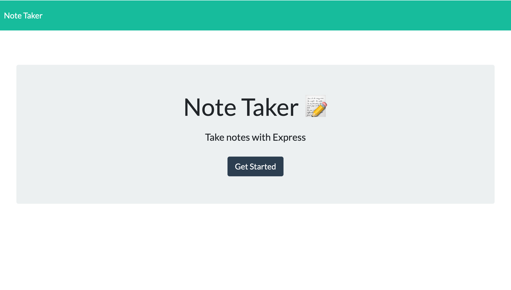

# Note-Taker

## Description
Note Taker is an application using Express and Node.js. This application create notes , view those notes and delete notes that are being stored in the notes.json file

## Core Skills

* Express
* FS library
* Path
* UUID Function

## Mock-Up

## Deployment

* Checkout note Taker on heroku
  * [note](https://notapps1.herokuapp.com/)

* The URL of the GitHub repository 
* [Repository](https://github.com/Chrisolsen1993/Note-Taker)

## Collaboration
* David Dyer
